# HotelReservationSystem-C-PROJECT :star_struck: :open_file_folder: :computer: :closed_book:

[](https://shields.io/) [](https://shields.io/)
<br>

***This new HOTEL RESERVATION SYSTEM using C is created by Biswarup Bhattacharjee, student of BTECH, in University of Engineering and Management, Kolkata.***

**Email Id: bbiswa471@gmail.com.** 

**Contact No: 916290272740.** 


<p align="left">
<a href="https://www.facebook.com/profile.php?id=100070395300810" target="blank"></a>
<a href="https://instagram.com/biswarup2210" target="blank"></a>
<a href="https://github.com/biswa2210/biswa2210" target="blank"></a>
</p>

## About :point_down: 

<div align="justified">
 
The project HOTEL RESERVATION SYSTEM is used for keeping record of each and every customers of hotel in a database format. Usually, this system is handled by receptionists, record managers. It is confidential and cannot be opened by others. When a customer comes, his details should be recorded by this system. All details of a customder should be kept carefully. All customers list is maintained. So, the unoccupied rooms can be given to new customers. When customer checkes out from hotel then the total fees and cost is given to him for payment. The records of the patients are kept confidentially. I have created a program hotel.c. I have used structure, array, pointers, if else, switch case, while loop, do while loop and file handling. I have designed the output screen in various ways. I have used file as a database for this project. This system can be modified and also can be deployed.

</div>

## HOTEL RESERVATION SYSTEM DEMO VIDEO: :point_right: <a href="https://www.youtube.com/watch?v=VpuShkjY0bM&list=PL0lbDlMJ1h4g3cSTY44VyQ4Z-5L4kbo2a&index=3">Click here to watch</a>

## C and C++ PLAYLIST: :point_right: <a href="https://www.youtube.com/watch?v=m5VnSust32E&list=PL0lbDlMJ1h4g3cSTY44VyQ4Z-5L4kbo2a">Click here to watch</a>


## Purpose :point_down:

<div align="justified">

I have created it in for my first sem project. I have practiced file handling concepts in C and got a basic idea of management systems.

</div>

## Folder Structure :point_down:
```bash
Hotel Management System
        └── hotel.c
```
## Screenshots :point_down: 

<div align="center">

<a href="pics/h1.png">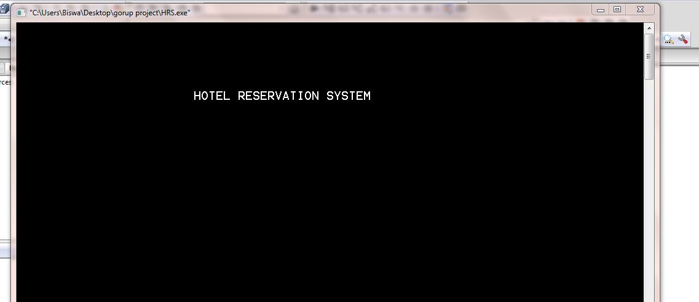</a>

<a href="pics/h2.png">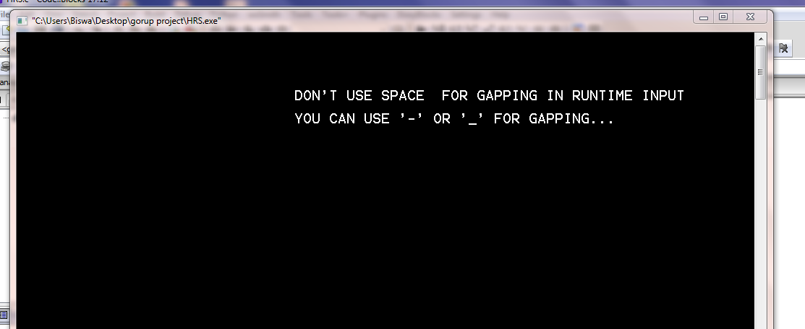</a>
 
<a href="pics/h3.png">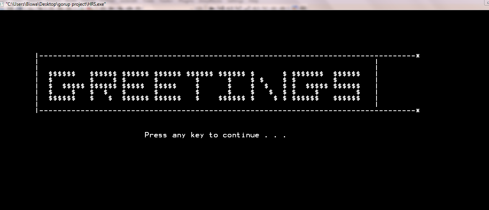</a>
 
<a href="pics/h4.png">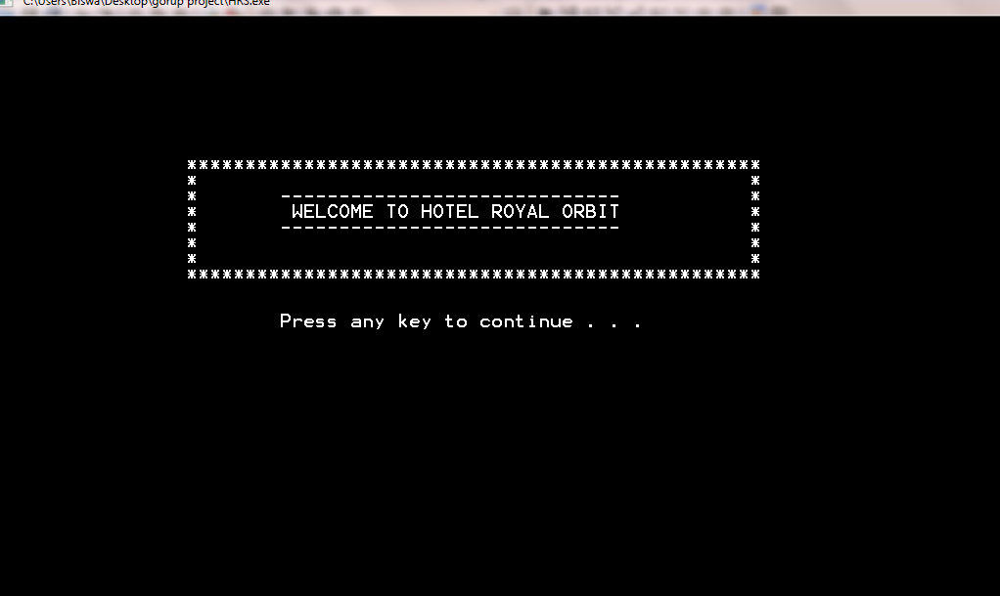</a>
 
<a href="pics/h5.png">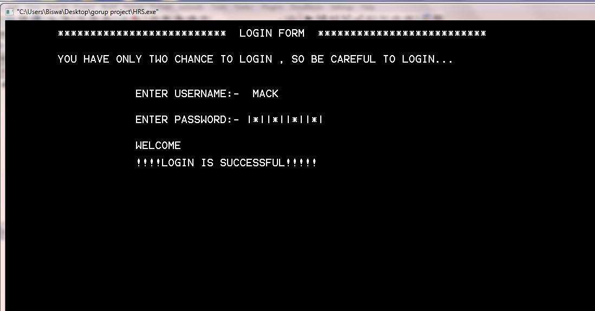</a>
 
<a href="pics/h6.png"></a>
 
<a href="pics/h7.png">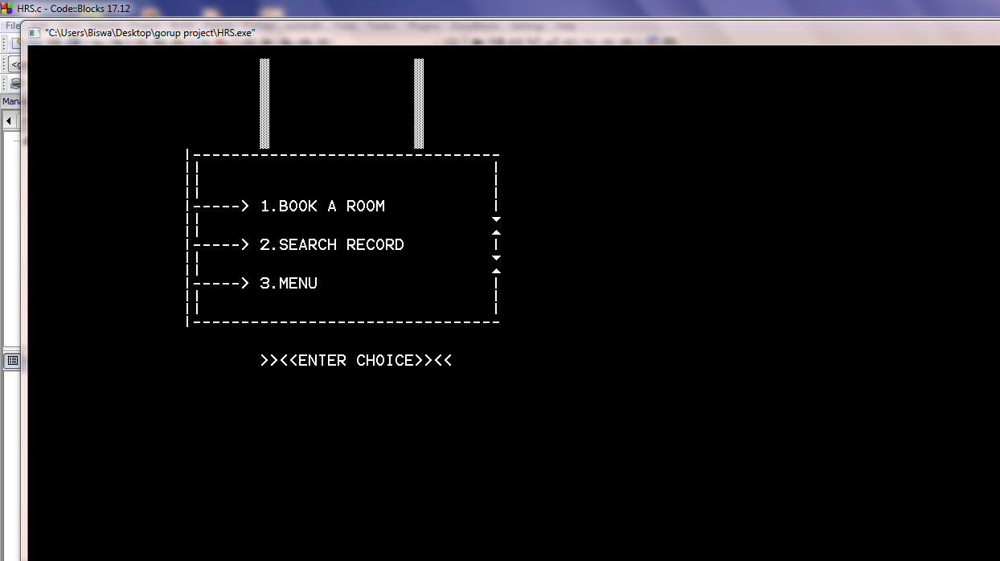</a>
 
<a href="pics/h8.png">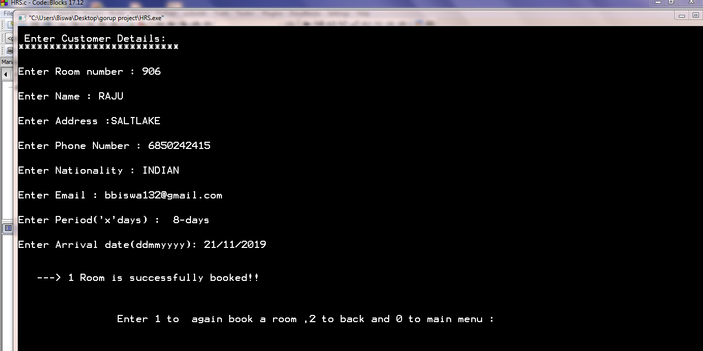</a>
 
<a href="pics/h9.png">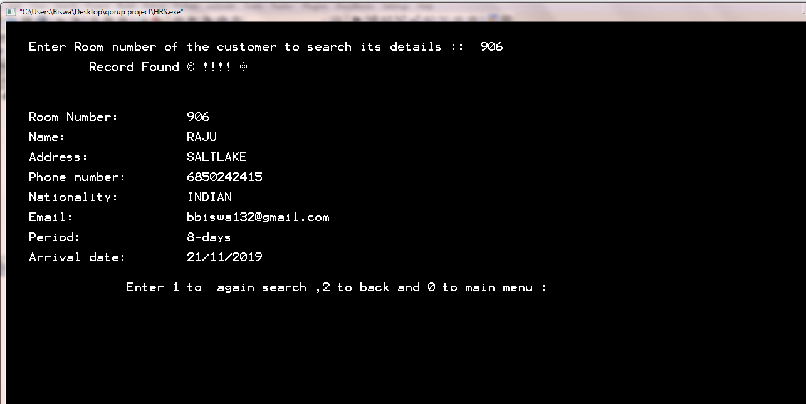</a>
 
<a href="pics/h10.png">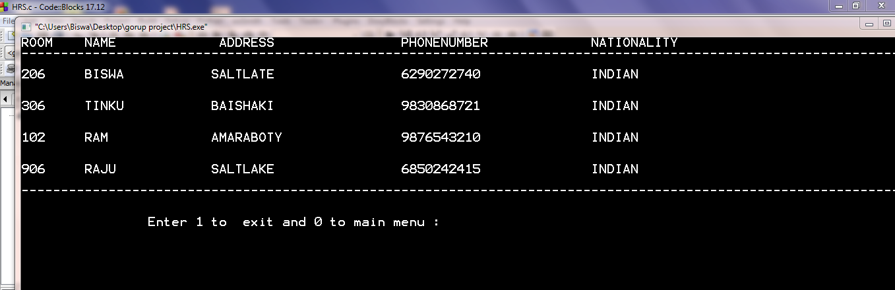</a>
 
<a href="pics/h11.png">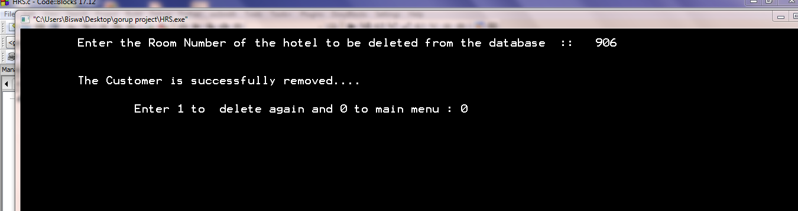</a>
 
<a href="pics/h12.png">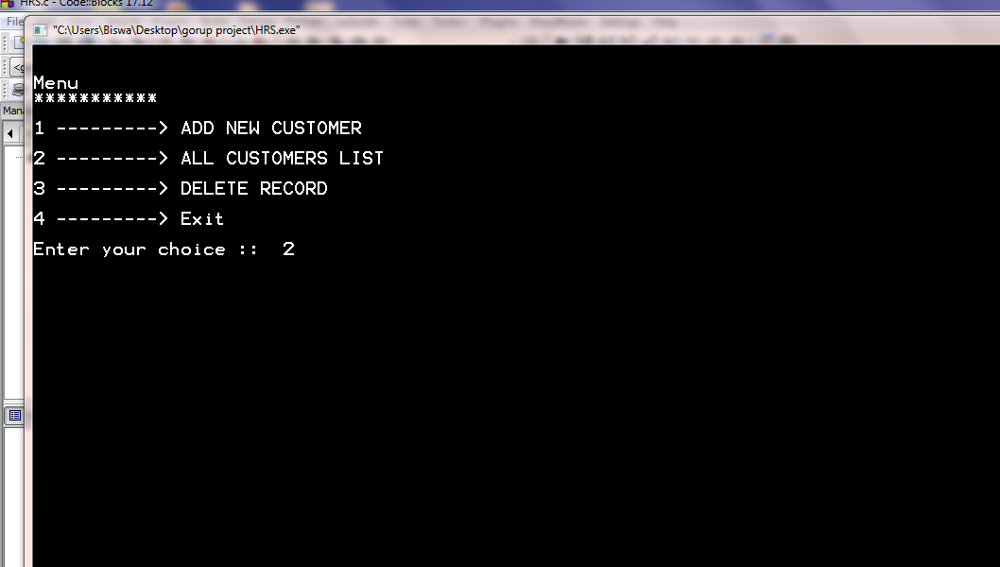</a>
 
<a href="pics/h13.png">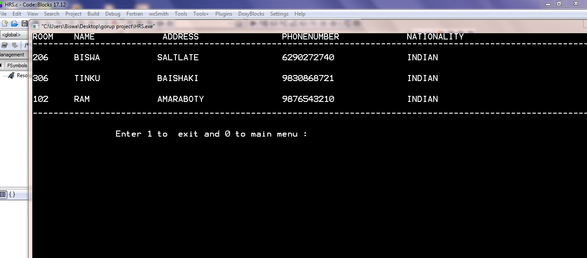</a>
 
<a href="pics/h14.png">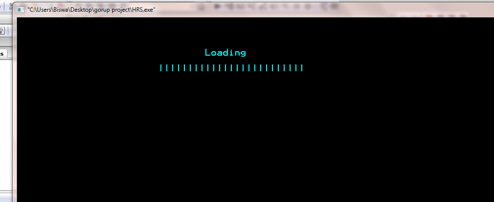</a>
 
<a href="pics/h15.png">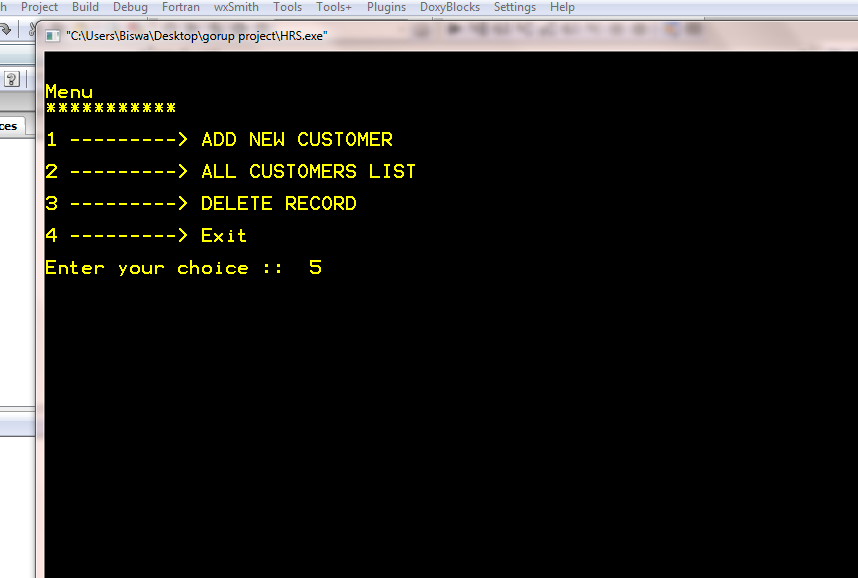</a>
</div>


